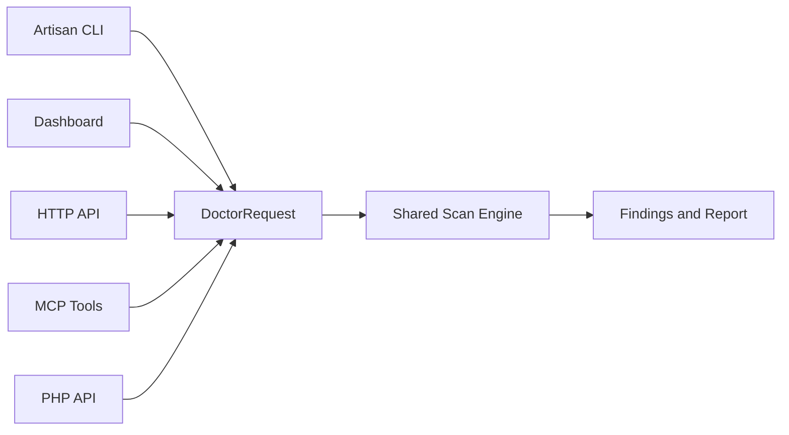

<p align="center">
  <a href="https://laravel-doctor.kayed.dev" target="_blank">
    
  </a>
</p>

# Laravel Doctor

[](https://github.com/kayedspace/laravel-doctor/actions/workflows/tests.yml)
[](https://www.php.net/)
[](https://laravel.com/)
[](https://opensource.org/licenses/Apache-2.0)
[](https://laravel-doctor.kayed.dev)

Laravel Doctor is a command-first diagnostics package for Laravel applications.
It exposes one shared analysis engine through Artisan, a browser dashboard, an HTTP API, MCP tools, and a public PHP API.

> **Note:** Public beta is now available.

## 🌟 Features

- **Command-first Diagnostics**: Run fast, comprehensive checks directly from your terminal.
- **Beautiful Dashboard**: A zero-build, Tailwind and Alpine-powered UI to view your reports.
- **MCP Integration**: First-class tools for AI coding assistants and agent workflows.
- **Machine-readable Output**: Export scan results as JSON, SARIF, or consume them via HTTP API.
- **Shared Engine**: A single, robust analysis engine powers the CLI, Dashboard, and APIs simultaneously.
- **CI/CD Ready**: Built-in support for GitHub Actions and code-scanning workflows.

## 📖 Full Documentation

The complete, live documentation is available at: [https://laravel-doctor.kayed.dev](https://laravel-doctor.kayed.dev)

Please refer to the official documentation for complete usage instructions, configuration options, MCP client setups, GitHub Actions integration, and API references.

## ✨ Dashboard Preview

Laravel Doctor includes a zero-build browser dashboard to intuitively inspect your application's health.

<p align="center">
  <a href="https://laravel-doctor.kayed.dev" target="_blank">
    
  </a>
</p>

<p align="center">
  <a href="https://laravel-doctor.kayed.dev" target="_blank">
    
  </a>
</p>

## 🚀 Quickstart

### 1. Installation

```bash
composer require kayedspace/laravel-doctor
```

### 2. Run Diagnostics

```bash
php artisan doctor:scan
```

### 3. Open the Dashboard

Visit `/_doctor` in your local environment. 
*(If you need to customize the route or access gates, publish the configuration file).*

## 🧩 Architecture



## 🔐 Security Notes

- Static rules do not boot Laravel.
- Booted runtime rules are designed to remain read-only.
- Reports redact known secret-looking values before serialization.
- Do not expose the dashboard or HTTP API in shared environments without authentication.

## 🤝 Development & Contributing

See [CONTRIBUTING.md](CONTRIBUTING.md) for package development and documentation workflow expectations.
